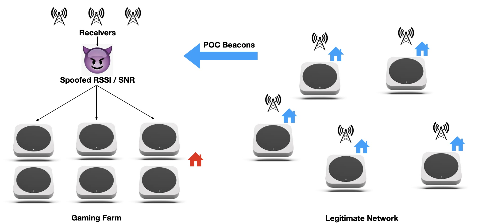
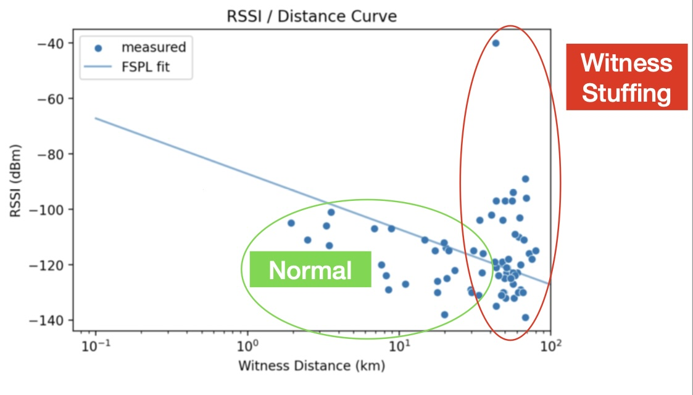
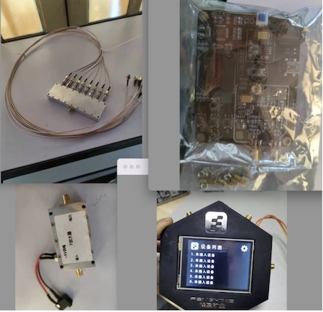
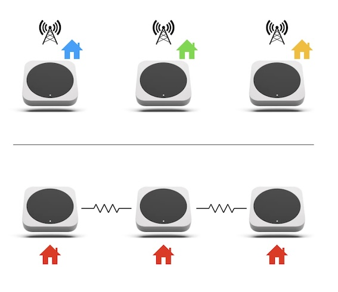
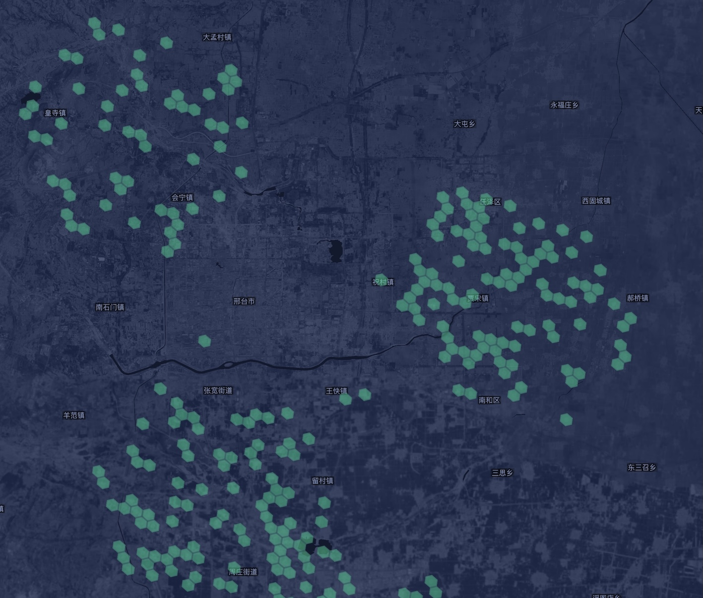
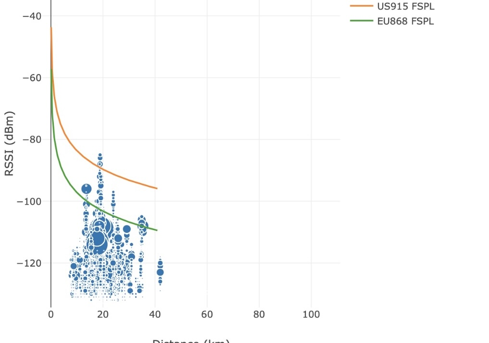
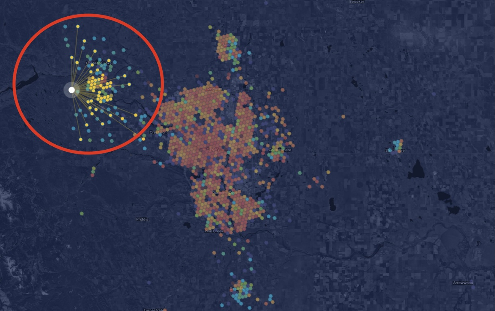
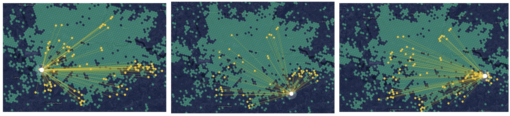

# Attack Profiles

This section explains the known types of attacks carried out against the IoT network and the classifiers used to detect them.

## Witness Stuffing

Witness stuffing is a type of man-in-the-middle attack (see the original research: [HeliumOver](https://github.com/tanisman/heliumover), and the general description: [Wikipedia](https://en.wikipedia.org/wiki/Man-in-the-middle_attack)). In a witness stuffing attack, one hotspot—typically in a favorable location with a large coverage area—receives beacons from many other hotspots and then forwards them over the internet to be received by other hotspots owned by the attacker. This artificially inflates the number of beacons received by the attacker's hotspots, increasing their rewards. The process is shown schematically below:

Witness stuffing is the most widely used form of spoofing against the IoT network and also the most damaging. Since the stuffed beacons originate from many hotspots, not all of which are part of the scheme, it can wrongly implicate legitimate actors. Worse, the incentive model financially motivates attackers to include as many beacons from as many different hotspots as possible.

There is no known limit to the scale at which this attack can be executed or the number of hotspots that may be involved. Determining which hotspots are actively participating in a witness stuffing attack and which ones are unwilling bystanders is non-trivial. However, the classifiers described in the [classifier documentation](classifiers.md) can identify this activity with a high degree of certainty.

Witness stuffing is known to be implemented using modified software running on the gateways themselves. This firmware is not open-source and, aside from the original research source mentioned above, is circulated in discrete Telegram groups. There is an ongoing attack—primarily located in Turkey and Eastern Europe—where witness stuffing is sold as a service. Participants pay to receive spoofed packets, which are centrally collected and distributed by attackers.

The primary mitigation against witness stuffing relies on the fact that beacon packets are encrypted, meaning attackers cannot know in advance which hotspots they are transmitted from. When a witness stuffer receives and subsequently forwards packets to other participants in the scheme, they do so without knowing the locations or antenna gains of the beaconers. Since packets are being sent by the attacker over the internet instead of over a radio channel, this inevitably leads to inconsistencies in the returned data.

The key giveaway that a hotspot is complicit in witness stuffing is that most or all of its traffic occurs between hotspots with no line of sight. Since LoRa signals cannot reliably transmit through significant terrain or beyond the horizon, such communication must have occurred over the internet, and the traffic should be treated as illegitimate. Another indication occurs when there is no decrease in RSSI (received signal strength indication) or SNR (signal to noise ratio) for the beacons which a hotspot receives as a function of their distance. As before, since the hotspot receiving illegitimate beacons over the internet does not know the transmitter locations, the relation between signal strength and distance returned is either pure, random noise, or a constant. Neither are realistic, since all signals lose energy as they propagate.

This is an example of a hotspot participating in witness stuffing. The beacons which it receives over radio map naturally to a decrease in signal strength with distance, while the ones which it receives over the internet do not. Some hotspots, like this one, combine legitimate radio traffic with witness stuffing to increase rewards and evade detection. 

## Attenuator Clustering

The second major attack on the Helium IoT network is carried out at the hardware level. In this style of attack, hotspot antenna ports are directly wired together through a signal attenuation network, allowing the RSSI of packets sent via the network to be more consistent with the incorrectly asserted distances between the hotspots. This is typically done to maximize the transmit scale ([see documentation](https://docs.helium.com/architecture/hexagons/#:~:text=Transmit%20scale%20is%20a%20multiplier,12%20down%20to%20resolution%204)), increasing the number of HNT tokens earned. 

This attack was most prevalent during 2021–2022 but has since been largely replaced by the man-in-the-middle witness stuffing attack described in the previous section. A photo of hardware typical of this era follows. This hardware has multiple inputs and outputs with connectors, intended to be wired directly to hotspot SMA connectors. The more sophisticated model below implements a menu and adjustable attenuation values in the device firmware:

The operation of a typical attenuator clustering attack is shown schematically below:

In this example, the red houses represent hotspots with falsely asserted locations, connected by attenuators. The legitimate network above communicates over radio and does not interact with the attacking hotspots, as they do not have antennas.

Compared to the man-in-the-middle attack, the attenuator clustering attack is more simple to detect. Hotspots participating in the scheme display the following key properties:

- Topology: Since these hotspots are physically wired together, they never fail to decode each other's packets. Reciprocity (see [reciprocity classifier](classifiers.md)) between each hotspot is exactly 1.0, indicating perfect communication with no packet loss, which never occurs in real-world radio networks.
- Connectedness: Each hotspot in the attenuator network connects to all others, forming a fully connected cluster to maximize rewards. In real-world deployments, perfect connectedness is never observed due to obstructions such as terrain and buildings.
- Location assertions: Each hotspot is asserted in the same general location, typically far from legitimate deployments. These locations are usually in rural areas with no infrastructure, making the deployment improbable.

The following is an example of a cluster deployment with asserted positions. Of note is the unnatural, organized geometric pattern of the hotspot placements:

Attenuator clusters sometimes display an additional key property: an RSSI-to-distance curve for received packets that perfectly follows the theoretical FSPL (free space path loss) equation. Since attackers control the asserted locations of each member of the cluster, they can tune the reported RSSI for received beacons to follow any pattern. The typical choice is the FSPL model based on their regional frequency and maximum permitted transmit power.

A typical legitimate RSSI-to-distance curve for received packets is shown below, with the theoretical curves for the EU868 and US915 frequency bands. An attenuator cluster will either display a random pattern or follow the theoretical curves exactly. In rare cases, random noise is added to the FSPL curve, but this noise is never scaled appropriately and is simple to detect by analyzing the statistical distribution of the noise relative to the signal-to-noise ratio (SNR).

The following are examples of attenuator clusters that have asserted themselves near a legitimate network. Note the high transmit scales compared to the surrounding hotspots, and how there is no communication between the cluster and the rest of the network, despite being in close proximity. In these examples, connections between hotspots in the cluster occur at greater distances but with more reliability than those of the nearby legitimate hotspots. In the second example, the witnesses of each hotspot in the cluster are identical and only involve other cluster participants. See the [reciprocity classifier](classifiers.md) for details on how this behavior can be quantified.

## Hybrid Attacks

In some cases, attackers combine attenuator cluster attacks with software-based man-in-the-middle or witness stuffing techniques. This is done both to increase rewards and to obfuscate the behavior in an attempt to evade automatic detection. The detection criteria are the same as for the individual attack methods, with the following key differences:

1. Hybrid attacks are sometimes used offensively to implicate nearby hotspots and undermine the perceived legitimacy of detection algorithms.

2. The RSSI-to-distance relationship becomes less clear in the hybrid approach. Since the software component of the attack cannot decode encrypted beacons and does not know the asserted locations of the other participants, at least part of the RSSI-to-distance curve will consist of random noise. This can be detected by subtracting the theoretical FSPL component from the measured signal and using a histogram to visualize the resulting distribution. The residual measurements are bimodal, with a clearly disjoint component corresponding to beacons received via witness stuffing.
