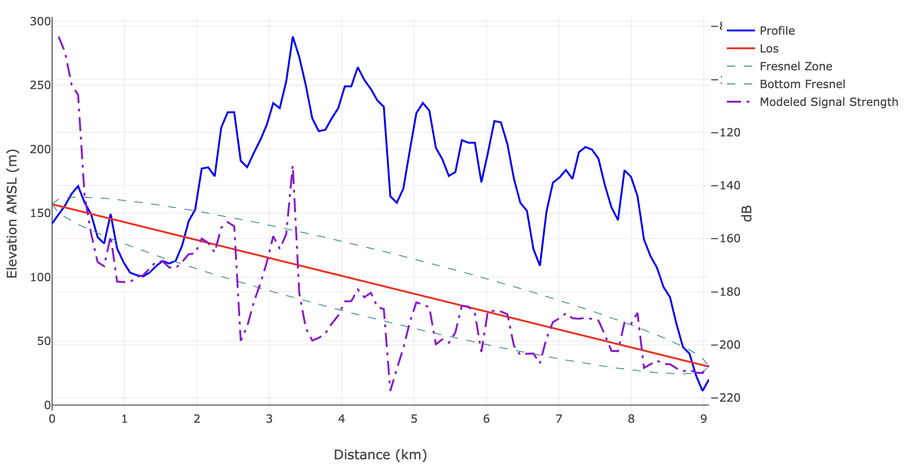
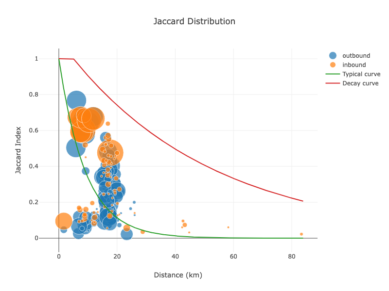
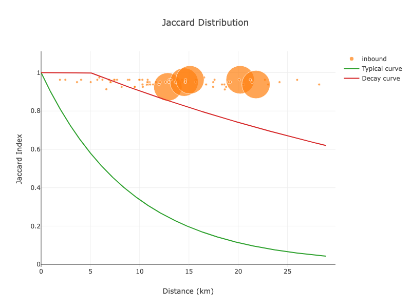

# Classifier Design

The classification pipeline uses a set of programs (classifiers) that run tests on data from the Arango ETL to check for unexpected behavior on the IoT network. The output of each classifier is a boolean flag (pass/fail), along with optional debug output that depends on the classifier being run. Thresholds for each classifier are specified in `settings.toml`.

The design, input, output, and interpretation of data for each classifier are outlined below. All classifiers operate on aggregate data for a given two-week span of ingested data.

## Edge Methodology

The IoT network is represented as a set of nodes (hotspots) and edges (Proof-of-Coverage witnesses and beaconers). The aim of the classification system is to report on problematic edges, rather than problematic nodes. This is because the degree of harm caused by a potential false positive is less: a typical hotspot has tens to hundreds of edges and is rewarded on this basis. Instead of preventing a hotspot with flagged edges from receiving rewards entirely, the specific problematic edges are flagged. This takes the form of a `(source, destination)` pair, where both source and destination are base64-encoded hotspot addresses.

The assumption is that hotspots deliberately engaging in spoofing behavior will have most or all of their rewarded edges flagged, while hotspots with only a few flagged edges will be largely unaffected. This is important considering that only one of the two hotspots involved in transmitting or receiving a PoC beacon can be misasserted, but both would receive fewer rewards from the flagged edge.

The edge methodology sidesteps the problem of assigning blame for a bad classification result, in exchange for running a more computationally intensive process with a larger memory footprint.

## Terrain Intersection

The terrain intersection classifier is based on the fact that LoRaWAN signals (which are sent at UHF frequencies or above) do not reliably propagate through significant terrain obstructions between the transmitter and receiver. A line of sight is drawn between the transmitter antenna and the receiver antenna based on the last available asserted location and height above ground level. 

The overlap between the terrain profile (measured in meters above sea level) and the line of sight (measured in kilometers from the transmitter) is used to derive the terrain intersection, which is an area measured in units of meters times kilometers. The default cutoff value is **500 m·km**.

The following graph illustrates a pair of hotspots with significant terrain intersection (**750 m·km**), which makes communication over radio improbable:



The Fresnel zone (shown in cyan) is a bubble around the line of sight between the transmitter and receiver. Obstructions in the Fresnel zone cause signal degradation through multipath interference (where different scattered portions of the signal are received at slightly different times), but may not prevent reliable communication. The default permissible terrain intersection value of **500 m·km** was chosen to account for this effect.

Exceptions to line-of-sight propagation include troposcatter (see: [Tropospheric scatter](https://en.wikipedia.org/wiki/Tropospheric_scatter)) and reflections from water. These effects are inherently sporadic and unpredictable outside of their aggregate statistical properties. These exceptions are ignored because, while communication beyond visual line of sight can occur, it is unreliable, and therefore does not represent useful coverage for LoRaWAN devices such as sensors.

## Low RSSI

The Received Signal Strength Indication (RSSI) is a measurement of the amount of received radio energy, expressed in dBm. For a LoRaWAN packet to be successfully decoded by a gateway, its RSSI must be above a certain minimum threshold. This threshold varies depending on the LoRa modulation parameters, including spreading factor, bandwidth, and coding rate. The thresholds are specified in the datasheets for each LoRa concentrator chipset.

For example, the SX1301 concentrator supports decoding packets with an RSSI as low as -139.5 dBm ([Semtech SX1301 Datasheet](https://www.semtech.com/products/wireless-rf/lora-core/sx1301)). Other concentrator chipsets in use across the network have similar performance, with minor variations that fall within a narrow and well-characterized range.

The Low RSSI classifier flags edges where the reported RSSI falls below this practical decoding threshold. The default cutoff is set to **-140 dBm**, which is slightly below the best-case decoding limits of all concentrator cards deployed on the Helium IoT network. This value was chosen to be conservative, avoiding the risk of flagging legitimate but weak signals while still capturing transmissions that are highly improbable to decode under normal operating conditions.

Noise, interference, and hardware variability can cause minor deviations in RSSI, but consistent reporting of values below -140 dBm suggests behavior that is not technically possible given radio performance specified by the manufacturer. 

## Maximum Distance

LoRa signals on the Helium IoT network do not reliably propagate beyond the horizon. This places an inherent upper limit on their range (`d_l`), which is determined by the antenna height and the radius of the Earth:

where `R` is the radius of the Earth (approximately 6,378,000 meters), and `h` is the transmitter antenna height above ground level. For example, an antenna asserted at a height of 5 meters above the surrounding terrain would have a maximum line-of-sight range of approximately 8 kilometers before being blocked by the curvature of the Earth.

The default threshold for the maximum distance classifier is 100 kilometers. This value was chosen based on the following considerations:

- The IoT network is designed to provide connectivity to ground-based devices, which are rarely deployed on tall structures. This naturally limits their line-of-sight range to values well below the 100 km threshold.
- The theoretical line-of-sight range represents a best-case scenario. In practice, signal propagation is further reduced by terrain, foliage, buildings, and other obstructions.
- Less than 1% of valid Proof-of-Coverage transmissions between gateways occur at distances greater than 100 kilometers. Distances beyond this threshold are considered statistically anomalous and more likely to be the result of misreporting, spoofing, or misconfiguration than the provision of useful coverage at this range. 

This classifier flags any edge where the reported distance between transmitter and receiver exceeds the maximum permissible range. While true long-range reception is possible under exceptional atmospheric conditions (such as ducting or tropospheric scatter), these effects are rare, unpredictable, and not reliable for consistent device communication. Therefore, such cases are treated as outliers and excluded by default.


## Reciprocity

The reciprocity classifier calculates the ratio of packets transmitted and received between a given pair of hotspots. This is computed according to the following formula:

```
reciprocity = (number of beacons sent) / (number of beacons received)
```

For a normally operating pair of hotspots, this ratio is expected to be close to 1.0, indicating a bidirectional link with similar success rates in both directions. A strong bidirectional link suggests that transmit power, antenna gain, and local radio interference levels are suitable for reliable communication. 

Reciprocity may break down if one hotspot is using power amplifiers to boost the range of its transmitted signals. Not only are these amplifiers illegal to operate in most LoRaWAN regions, but most consumer variants either attenuate the receive path or block it entirely, preventing any packets from being received. Reciprocity may also not apply when gateways are modified to unfairly send or replay packets at a rate higher than their surrounding peers.

A hotspot placed in an environment with a high level of local radio noise may have a low reciprocity value. Some natural variation is expected, which is why the default threshold for the reciprocity classifier is set to 0.5. Measured reciprocities lower than this often indicate that the given hotspot has trouble receiving signals, which can prevent IoT devices from joining the network, regardless of cause.

## Free Space Path Loss (FSPL)

The FSPL (free space path loss) classifier predicts the expected signal strength of a beacon received by a Helium gateway, under the assumption that there are no obstructions or terrain. Since this is the most optimistic model, it effectively places an upper limit on the measured RSSI that gateways can receive from a given transmitter as a function of distance.

Free space path loss is given by the following formula:

```
FSPL(dB) = 20 * log10(d) + 20 * log10(f) + 20 * log10(4 * π / c)
```

where:

* `d` is the distance between the transmitter and receiver in meters.  
* `f` is the frequency of the transmitted signal in hertz.  
* `c` is the speed of light in meters per second.  


This can also be written as:

```
FSPL(dB) = 20 * log10(d) + 20 * log10(f) + 92.45
```

in engineering units (distance in kilometers, frequency in MHz). 

This equation models the attenuation of a signal as it propagates through free space. It assumes an ideal environment where no obstacles, reflections, or interference affect the transmission.

In practical cases, the actual received signal strength will always be lower than the FSPL prediction due to environmental factors such as terrain obstructions, multipath interference, and atmospheric conditions. If a measured RSSI exceeds the FSPL threshold, it suggests that the signal strength is artificially amplified, which may indicate the use of illegal power amplifiers or misconfigured hardware.

The FSPL classifier is used to flag transmissions with suspiciously high RSSI values that exceed the expected upper bound. The default threshold is set to the FSPL loss plus a "fudge factor" of 3 dBm, to account for variations in antenna performance and slight inaccuracies in asserted hotspot locations. 

## ITM

The ITM classifier uses the ITM (Irregular Terrain Model) or Longley-Rice model to predict the expected signal strength while accounting for the terrain profile between the transmitter and receiver. Unlike the FSPL model, which assumes free-space conditions, the ITM model provides a more realistic estimate of signal loss by incorporating real-world terrain effects. However, it does not establish a strict upper bound on received signal strength.

The ITM model relies on statistical inputs rather than exact transmitter, receiver, and terrain properties. One key parameter is the reliability threshold, which is set to 95% by default. This means the classifier returns estimates of signal loss that are expected to hold with 95% confidence.

Since the ITM model provides an estimate rather than a strict bound on received signal strength, it is disabled by default in the classification pipeline. It is primarily used for offline, comparative analysis, rather than direct anomaly detection.

More information on the ITM model, including its input parameters, outputs, and limitations, can be found here:  

[https://github.com/NTIA/itm](https://github.com/NTIA/itm)  

The implementation used by the Arango ETL is open-source and available at:  

[https://github.com/novalabsxyz/geoprop](https://github.com/novalabsxyz/geoprop)

## Jaccard Similarity / Distance Insensitivity

The similarity classifier measures how closely the witnesses of a given hotspot match each other as a function of distance. The idea is that the amount of information shared between a given hotspot, its witnesses, and the witnesses of its witnesses should normally decrease with distance. 

For example, if a given hotspot (call it "A") has a set of three witnesses ("B", "C", and "D"), the witnesses of "B", "C", and "D" are unlikely to be identical. This is due to the fact that obstructions, terrain, local signal interference, and random errors in signal propagation reduce the likelihood of successfully receiving a LoRa signal as the distance between the transmitter and receiver increases.

The similarity score is based on the Jaccard Index ([see Wikipedia](https://en.wikipedia.org/wiki/Jaccard_index)). The Jaccard similarity score between two sets of witnesses, `A_w` and `B_w`, for two hotspots (`A` and `B`) is given by:

J(A_w, B_w) = |A_w ∩ B_w| / |A_w ∪ B_w|

where: 

* `A_w` is the set of witnesses for hotspot `A`  
* `B_w` is the set of witnesses for hotspot `B`  
* `|A_w ∩ B_w|` is the number of witnesses common to both hotspots  
* `|A_w ∪ B_w|` is the total number of unique witnesses across both hotspots  

A high Jaccard similarity score indicates that two hotspots share a significant number of witnesses, suggesting they are in close proximity and have similar radio environments. Conversely, a low similarity score suggests that their witness sets are largely distinct, which is expected as distance increases.

The classifier flags cases where the Jaccard similarity remains unexpectedly high over long distances, as this may indicate artificial signal boosting, location spoofing, or hotspots sharing information over the internet, instead of their LoRa radios. This is accomplished by comparing the Jaccard similarity of a hotspots witnesses and comparing to an empirically derived, exponential curve. The slope of this curve is set based on aggregate statistical analysis of the network as a whole. 

The following figure is a graph of the Jaccard similarity between a hotspot's witnesses and their witnesses, as a function of distance. The size of each datapoint is proportional to the number of witnesses, and the color (blue or orange) corresponds to received or transmitted packets, respectively. This hotspot is behaving normally.



In the above figure, the green curve represents the expected pattern that most hotspots on the IoT network follow. The red "decay curve" represents a worst-case scenario, which almost all hotspots (99 percent) fall under. 

The same graph for an abnormal hotspot, participating in spoofing, follows:



In this example, not only do the Jaccard scores for the witnesses of each hotspot fail to follow the expected decay curve, but there is also zero variation as a function of distance. Additionally, only received beacons are present, with no transmitted beacons. This is a strong indication that the hotspot is receiving beacons over the internet instead of via its LoRa radio.

## Antenna Splitter Classifier

The Antenna Splitter classifier is designed to detect instances where two hotspots are likely connected to the same physical antenna. The classifier examines the asserted signal links between two hotspots and calculates the minimum possible path loss inferred from the strongest observed RSSI in the beacon/witness signal histogram. This inferred loss is then compared with:

    * The expected path loss from free-space propagation and,
    * The theoretical path loss if the hotspots were colocated within a configurable threshold (e.g. 10 meters).

The most recent asserted antenna gains and hotspot locations are used to make this calculation. The base logic is as follows:

* If the inferred signal loss is lower than what would be expected at the claimed distance, and also lower than the maximum expected loss at colocation distance, the link is flagged.

* To reduce false positives, this check is performed in both directions (beaconer to witness and witness to beaconer), and only those links that pass both reciprocal tests are returned.

The free space path loss is computed using `FSPL(dB) = 20 * log10(d) + 20 * log10(f) + 92.45`, where:

* d is the distance between hotspots in kilometers.

* f is the frequency of transmission in GHz.

The constant `92.45` accounts for the speed of light and units, as with the other classifiers. A fudge factor (default: 3 dB) is added to the expected path loss to account for minor variations in hardware and environment. If the observed loss is too low (i.e., signal is too strong), and both directions show the same behavior, the link is flagged. Unlike the FSPL and ITM classifiers, which compare expected vs. actual signal strength assuming accurate distance, the Antenna Splitter Classifier is tuned to detect abnormally strong, short-range links that are too good to be real.

One limitation of this classifier is that the link must be bi-directional (> 0 reciprocity) to be flagged. It is assumed that hotspots with no receive path, or ones using attenuation networks will be picked up by the other classifiers. 

Additionally, since hotspots connected to the same physical antenna both transmit and receive, they can cause severe RF coupling. Over time, the final stages of the LoRa radios in each hotspot may be damaged by direct exposure to each other's transmitted energy. As a result, it is common to see hotspots participating in this scheme degrade over time, eventually losing the ability to receive beacons at all. 

## Ingest Latency

The Ingest Latency classifier detects potential replay attacks by analyzing the time delay between when a beacon is transmitted and when it is received (witnessed) by other hotspots. This delay, known as ingest latency, is a useful signal for identifying abnormal network behavior, particularly when LoRa packets are captured and re-broadcast later.

The classifier uses a histogram of ingest latency values collected for each asserted beacon/witness pair. These histograms are generated by measuring the time delta between the transmit timestamp and the receive timestamp of a given beacon. The expected behavior in a healthy network is that this latency remains very low, with the mean typically under 1 second.

A significantly longer delay may indicate:

* A slow or unreliable internet connection between the gateway and the Helium network backend (rare, but possible)

* Replay attacks, where a malicious actor records a beacon and replays it from a different location

* Hotspots that forward received packets instead of originating them via LoRa (e.g., via VPNs, proxies, or software-defined radios)

Since LoRa transmissions themselves typically last less than one second, ingest latencies greater than this threshold are anomalous. The classifier flags beacon/witness pairs where the average latency exceeds a configurable threshold. 

