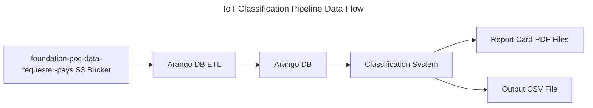

# Data Flow

## Overview

Data for the classification pipeline flows according to the following diagram:

The upstream Amazon S3 bucket `foundation-poc-data-requester-pays` contains binary data from the network oracles (see: https://docs.helium.com/oracles/oracle-data/). Data are stored in `.gz` compressed and timestamped protocol buffer (protobuf) files. The protobuf definitions are available at the following repository: https://github.com/helium/proto. This dataset is large (on the order of tens of TB), so downloading significant portions incurs data egress costs from AWS. This may be avoided by running the classification pipeline on an AWS instance which is in the same AWS region as the `foundation-poc-data-requester-pays` bucket: `us-west2`. 

The Arango ETL is a proprietary program written by Nova Labs, which ingests oracle data from the S3 bucket in batches and stores it in an ArangoDB graph database. The graph database represents the oracle data as a collection of nodes (hotspots) and edges (beacons and witnesses) based on the IOT Proof-Of-Coverage model (see: https://docs.helium.com/iot/proof-of-coverage/). The classifier program then reads from this database and generates output `.csv` files, which consist of hotspot addresses (pubkeys) and any flags for abnormal behavior from the internal classification algorithms. 

## Input

The protocol buffer files contain oracle data representing the interaction between hotspots as they undergo the proof-of-coverage (PoC) process. This includes the following key parameters for beaconers and witnesses:

* Timestamp
* RSSI (radio signal strength indication, dBm)
* SNR (signal to noise ratio, dB)
* Hotspot pubkey (base64 string)
* Hotspot location (H3 indexed, see: https://h3geo.org)
* Antenna gain (dB)
* Antenna elevation (meters)

## Output

The classifier output consists of two outputs: PDF "report cards" and a csv file. The PDF report cards contain graphs and sample data for each classifier output. The purpose of the report cards is to allow hotspot owners to observe abormal behaviour and take corrective action, such as accurately asserting hotspot locations. This is an example report card generated for a hotspot which triggers the "terrain intersection" classifier, which checks for radio signals reported to propagate through large terrain obstructions: [Example Report Card](figures/112aaZLp6rAe15ERqtWXHxvcbsM8b5ZBmypRStTvg17QLioDQc5R.html)

 The `.csv` output is used by the system to identify hotspots that exceed classifier thresholds. These flagged hotspots may have their rewards (HNT tokens) withheld, pending further verification. The CSV file columns contain a hotspot address, and a list of any triggered classifiers. 

Interpretation of these output files is described in [Data Interpretation](#data-interpretation). 