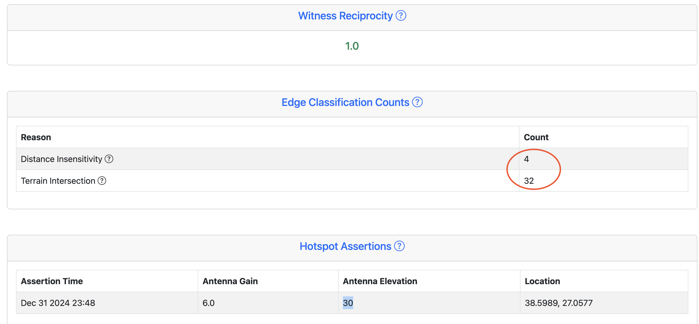
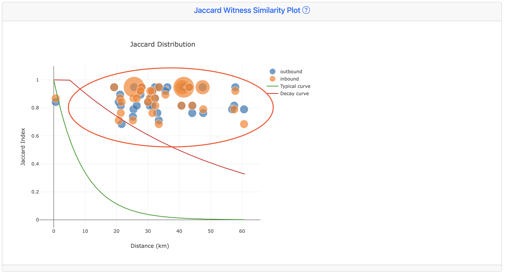
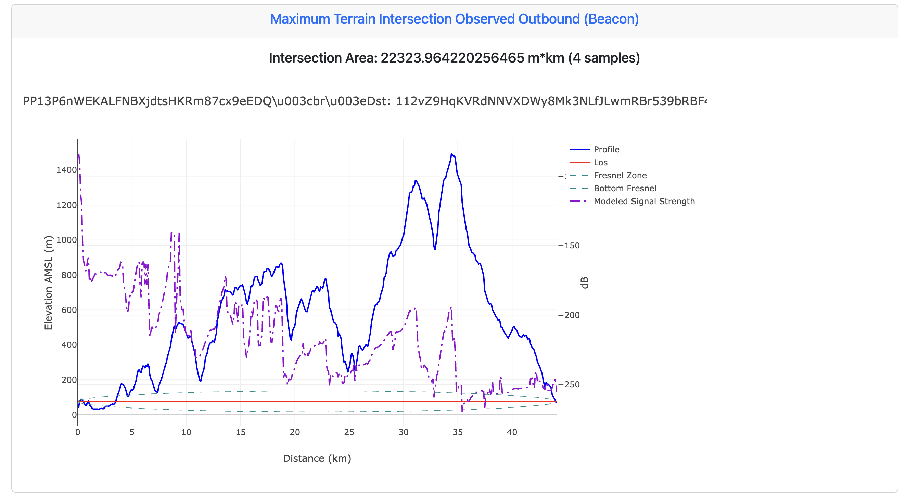
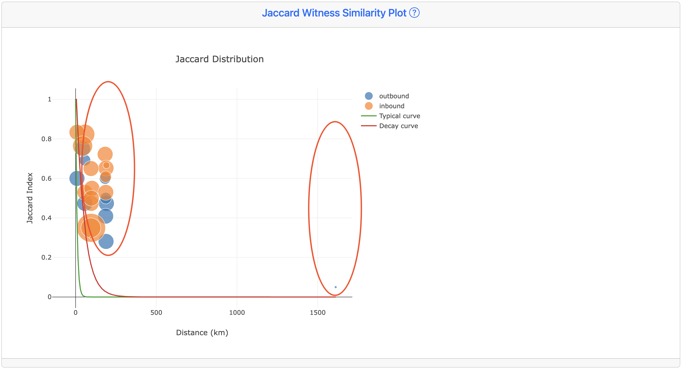
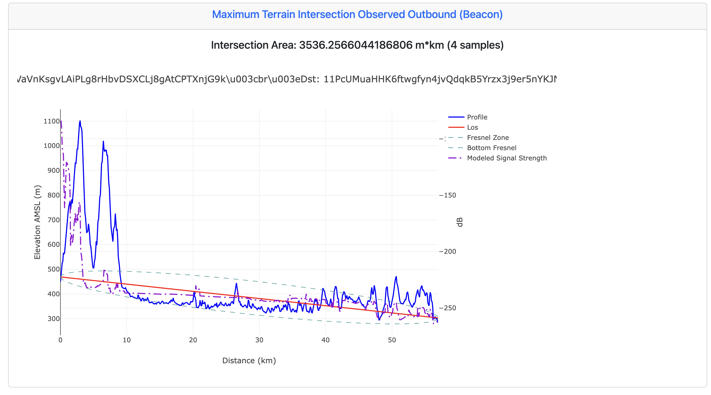
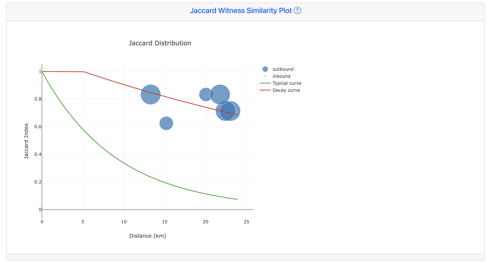
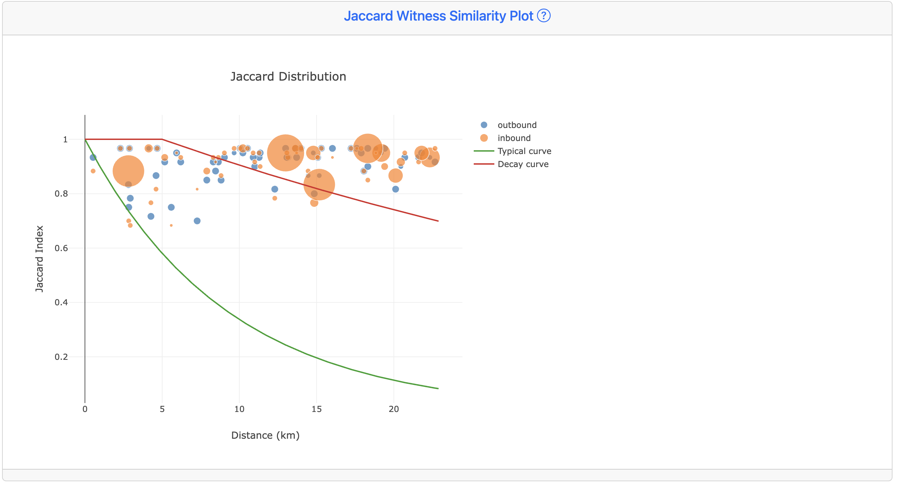
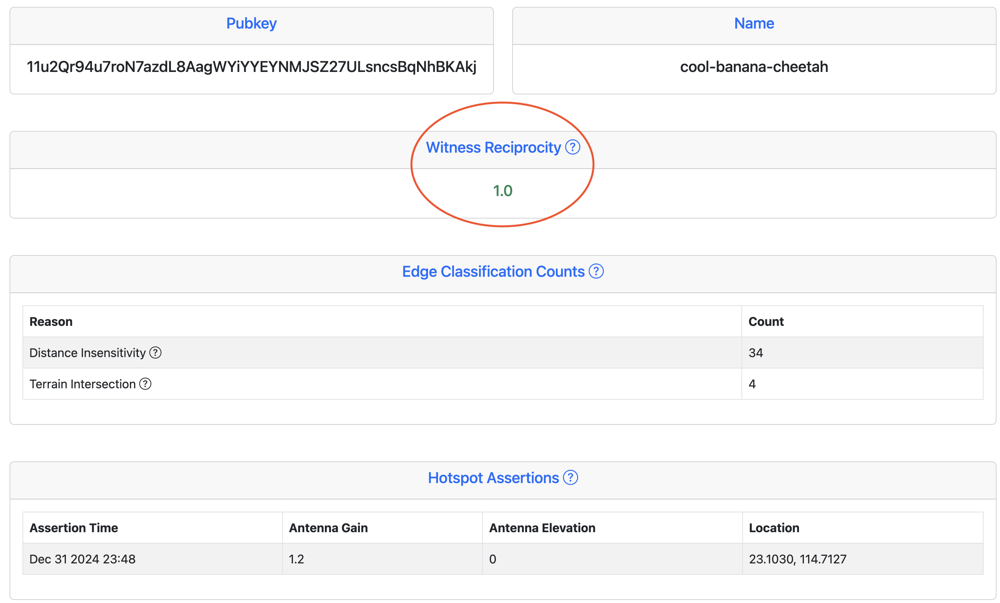
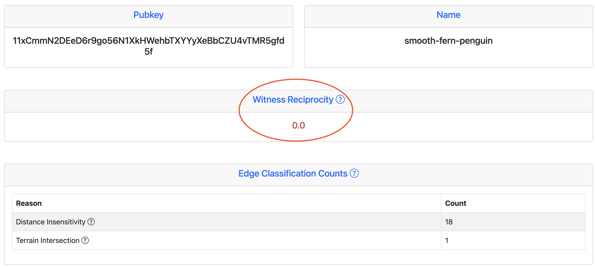
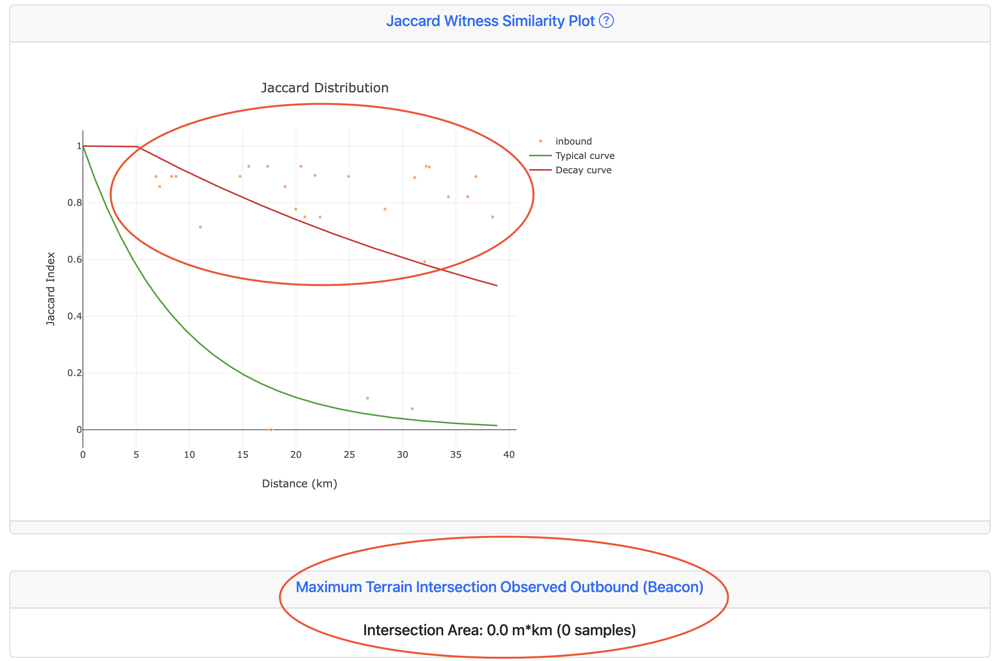

# Examples

The following are worked examples of outputs from a classification run and instructions for their interpretation. 

## 11F1qY5kyih7XbFhZ5PP13P6nWEKALFNBXjdtsHKRm87cx9eEDQ (suave-coral-moose)

This hotspot was asserted at Dec 31 2024 23:48 UTC, with coordinates 38.5989, 27.0577 and a 30 meter antenna elevation. The asserted antenna gain is 6 dBi, which is consistent with a large collinear antenna. 

Two classifiers (distance insensitivity and terrain intersection) were triggered across 32 and 4 edges, respectively:

The distance insensitivity graph, which looks for Jaccard similarity plots that do not scale naturally over distance, shows a flat distribution characteristic of witness stuffing attacks:

The above plot shows that despite large distances between this hotspot and its witnesses (on the order of 50 km), the beacons received by these witnesses are almost identical. This is a sign that the hotspot is forwarding data over the internet, instead of beacons via radio. Of particular note is that the distribution of the received beacons and transmitted beacons is identical across distance. In real hotspots, there is almost always a difference due to variations in the local noise environment of the hotspot witnesses.  

Further confirmation that this hotspot is participating in witness stuffing can be seen from the maximum terrain intersection plot:

LoRaWAN signals do not penetrate mountains over 1400 meters tall relative to the transmitter. This terrain graph is representative of all of this hotspots witnesses. The conclusion is that suave-coral-moose likely provides no usable coverage to devices at all.

## 11FyXQMTToo15VaVnKsgvLAiPLg8rHbvDSXCLj8gAtCPTXnjG9k (jovial-punch-yak)

This hotspot was asserted on Dec 31 2024, at 23:51 UTC with coordinates 26.8453, 110.4731 and an antenna elevation of 20m. As with the last example, the asserted gain is 6 dBi. Two classifiers (distance insensitivity and terrain intersection) were triggered across 1 and 8 denied edges, respectively.

The witness reciprocity of 0.529 is marginal, just above the cutoff value of 0.5. This does not necessarily indicate a problem with the hotspot, as long runs of coaxial cable, a high local noise environment, or a problem with the concentrator card itself can sometimes manifest as an asymmetric connection. 

The relatively low number of denied edges suggests that this gateway may be receiving beacons from other misasserted hotspots. The similarity plot displays a decay over distance, however, most of the data points lie above the characteristic curve (shown in green):

Most of the received beacons exceed the 100 km distance cutoff. Given that the asserted antenna height is 20m, this is impossible. One beaconer / witness pair even exists past 1500 kilometers.

The terrain intersection plot shows a maximum result of 3536.3 m*km, which exceeds the default cutoff value of 500 m*km by an order of magnitude.  

The conclusion is that this hotspot is definitely misasserted, and could potentially be engaged in witness stuffing, either as a receiver or as a transmitter. Given the similarity /jaccard curve does show a decay with distances in the near-field (less than 100 km), it is possible that some of the traffic to and from this hotspot is legitimate, indicating a hybrid attack. This hotspot may, or may not, provide some coverage to the IoT network. 

## 112Tn4wjVrrBVkRm4k2WwfEuTwDTGjWWaV86SE2PAj2hojePuAyS (amusing-coal-boar)

This hotspot was asserted on Jan 1 2025 at 01:42 UTC. The asserted coordinates were 41.0195, -8.6210, with an antenna height of 39 meters and a gain of 4.0 dBi. 

The only triggered classifier was Distance Insensitivity, across 4 edges. The reciprocity value is 0.16, which is below the threshold value of 0.5. The similarity plot indicates an overwhelming favorability towards sending signals over RF, instead of receiving:

The received beacons lie above the typical decay curve (green) and are marginal compared to the worst-case curve (red). This type of behavior is seen in two scenarios:

1) A faulty or damaged LoRa concentrator card, which loses the ability to receive beacons due to thermal stress, due to insufficient cooling. 

2) Use of an illegal power amplifier which blocks the receive path.

In both of these scenarios, the hotspot provides no useful coverage to the IoT network, as devices must be able to both transmit and receive using the gateway to process join requests and uplinks. 

## 11u2Qr94u7roN7azdL8AagWYiYYEYNMJSZ27ULsncsBqNhBKAkj (cool-banana-cheetah)

This hotspot was asserted on Dec 31 2024 at 23:48 UTC. The antenna gain is 1.2 dBi, and the elevation is 0m. There were 34 denied edges due to distance insensitivity, and 4 due to terrain intersection, respectively. 

The similarity curve is consistent with a witness stuffing attack:

The witness reciprocity value of 1.0 (perfect) is implausible. This is because the noise environment around any transmit / recieve pair of hotspots is inherently transient, and some packets are expected to be lost in one or both directions over time. 

Additionally, the distances at which beacons were received (20 kilometers) are not possible given the asserted antenna height of 0m, at ground level. This hotspot is almost certainly providing no useful coverage to the IoT network. 

## 11xCmmN2DEeD6r9go56N1XkHWehbTXYYyXeBbCZU4vTMR5gfd5f (smooth-fern-penguin)

This hotspot was asserted on Dec 31 2024 at 23:48 UTC for coordinates 31.0238, 29.9255. The witness reciprocity value of 0.0 indicates a severe problem:

Both the distance insensitivity and terrain intersection classifiers were triggered:

The similarity curve shows that this hotspot only receives beacons and never successfully transmits them. This is characteristic of a hotspot with no radio connectivity at all, which receives rewards strictly through beacons forwarded to it over the internet. The lack of any decrease in witness similarity as a function of distance is additional evidence for this behavior. 

There is no terrain intersection plot available, despite one edge having triggered that classifier. This may indicate a problem with the asserted location of the receiving hotspot. The graph will not render properly for extreme distances, such as when the received beacons are from another country. 

Based on the above graphs, this hotspot is acting as a "sink" for a witness stuffing attack, receiving beacons which are gathered by legitimate hotspots and sent to it over the internet. There is no useful IoT coverage being provided to the network. 

